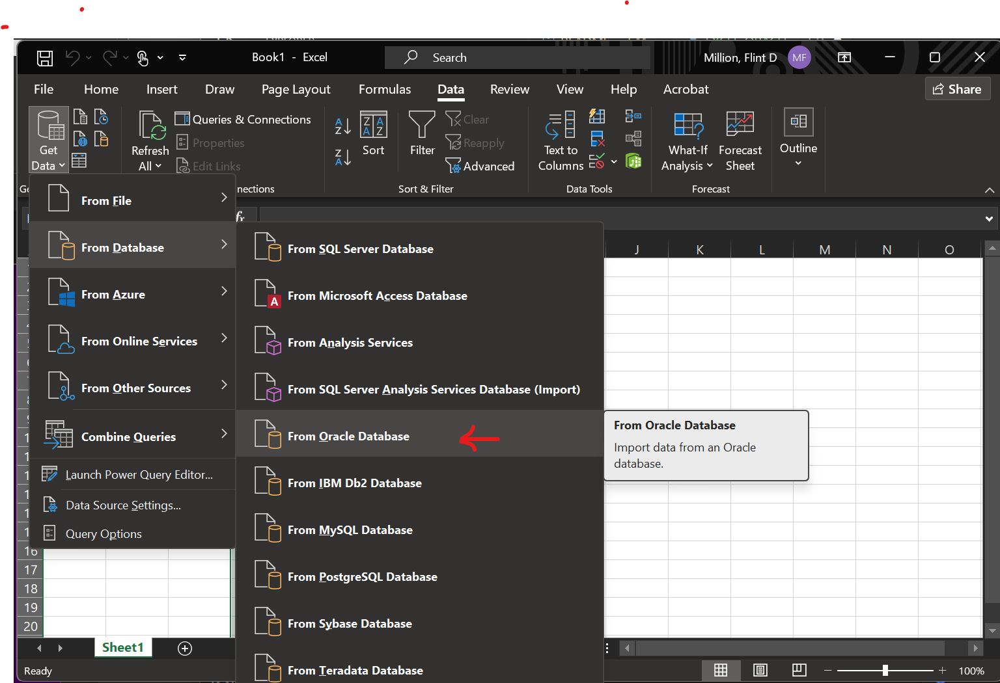
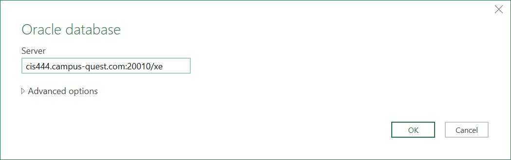
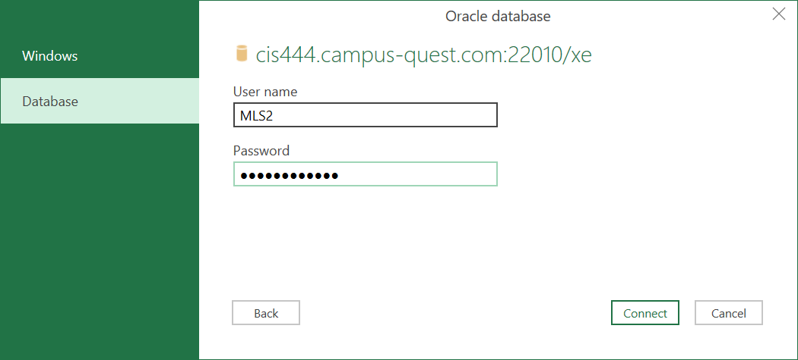
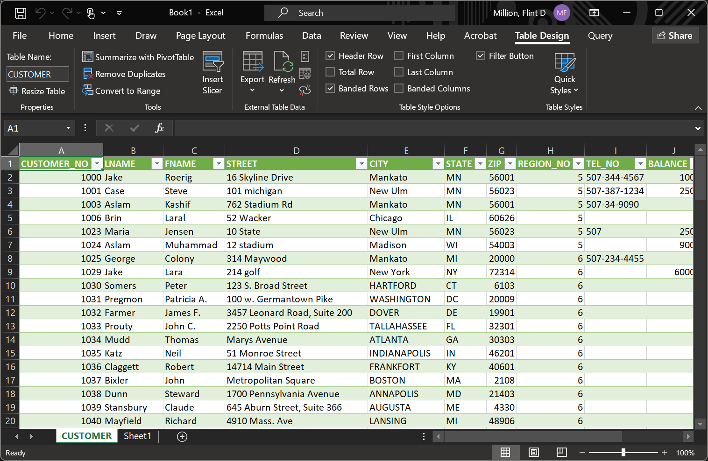

# Connecting Excel to Oracle SQL

Recent versions of Excel have built-in support for communicating with Oracle Database. However, you need to be aware of a few specifics when connecting to the servers for this course.

Follow these steps to get connected:

1. Download and install the latest Oracle Client for Microsoft Tools:
    * MNSU students can use [this link](https://link.mnsu.edu/xl9045qi/software) to access my Software Repository. You'll find the latest version under "Oracle Client for Microsoft".
    * Otherwise, you can download the latest version [from Oracle directly]. (Note: Oracle may require you to create an account.)
1. If you already had Excel running before installation, close and restart Excel.
1. Open the worksheet you'd like to import data to.
1. On the "Data" tab, choose "Get Data" -> "From Database" -> "From Oracle Database".

    

1. Enter `cis444.campus.quest.com:<port>/xe`. Replace `<port>` with the **port number** for your group's Oracle server.

    For example, Group 1 would enter `cis444.campus-quest.com:21010/xe`.

    
    > The `/xe` is the Service Name, which is required when connecting to an Oracle server. If you omit this, you will get an error referencing "no SERVICE_NAME".

1. If you are asked to provide login credentials, choose "Database" and enter the **database name** you are connecting to as the Username, and your group password as the password.

    

1. You can now select the database and table you want to import data from. 

    
    
    For example, to work with the `CUSTOMER` table in the `FAOES` database, follow the screenshot.

After a few moments the data should populate into your spreadsheet.

