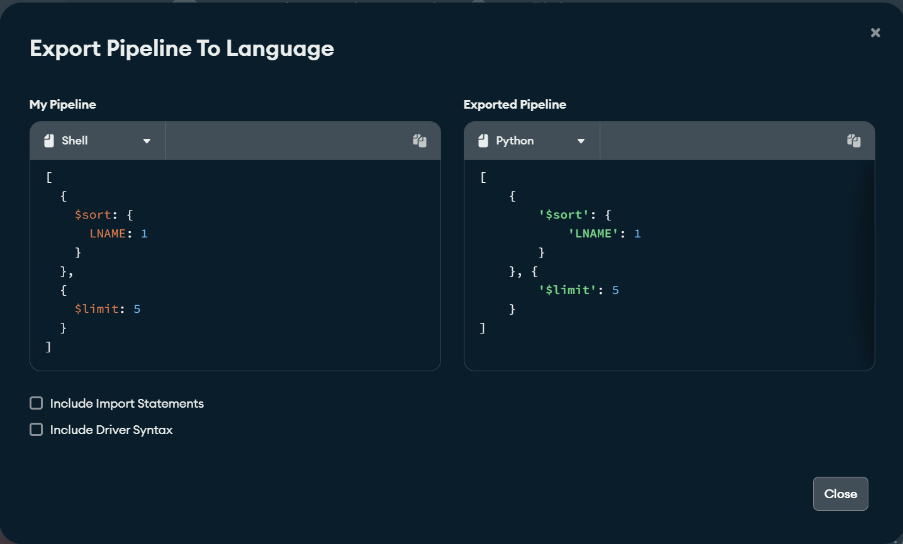

# Accessing MongDB from Python

This code will show you how you can access data from MongDB servers using Python. The data will be available to you as normal Python data structures - lists, dictionaries, etc.

This code shows you how you can execute a query in MongoDB's query language (known as MQL), which is a modified JSON-formatted query language where queries are submitted as JSON documents. MongoDB Compass will help you design and produce the actual JSON object for a query; it even has a convenient feature to copy the query, already prepared for your desired programming language (in this case, Python).

## Setting up the project

The main thing you need on your system is [Python](https://www.python.org/downloads/) (obviously!). Along with that, it's strongly recommended that you use an IDE such as PyCharm or VS Code to work with the code. 

The steps you will follow are as follows:

1. Make sure Python is set up on your system and the requirements for virtual environments are installed.
    - If you use Anaconda, you can [use it instead of `virtualenv`](#alternative-steps-for-anaconda-users). More information on this is included further on in the instructions.
2. [Download the code](#repository-download).
3. [Open the project](#open-the-project-in-your-editor) in VS Code, PyCharm, or your editor of choice.
4. [Edit the configuration variables](#explaining-the-code) to match the address, port, username, password, and so on for your group's servers.
5. [Run the code](#running-the-code) to make sure the database connection is working!

### Initial requirements setup

You also need to have `pip` installed, which is Python's built in package management toolset. On Windows, once you have Python installed, you should be able to run these commands at a command prompt to make sure `pip` is installed and updated to the latest version:

    python -m ensurepip
    python -m pip install -U pip

> On Windows, you may need to execute `python3` instead of `python` when installing `pip`. If you type `python` and receive a Windows Store popup, try `python3`.
>
> Note that once you activate a virtual environment, you must use `python` and **not** `python3`. This is due to a quirk in how Windows handles symbolic links.

Finally, you need the `virtualenv` module, which lets you setup virtual environments. Alternatively, `anaconda` has a similar capability with the `conda` package manager. These instructions will use `virtualenv`, but if you're using `anaconda`, I can provide separate support for that. 

To install `virtualenv`:

    python -m pip install virtualenv

### Repository download

Download the repository by [**clicking this link**](https://github.com/fmillion-mnsu/it544-python/archive/refs/heads/master.zip).

Extract the contents of the repository to somewhere on your computer.

### Open the project in your editor

Open the `python-mongodb` folder within the `cis444-resources` folder you extracted above. (Note that depending on how you extracted the data, you may have a nested folder - e.g. `cis444-resources\cis444-resources`. You want to select the *inner* folder in this case.)

Your editor may offer to create and setup the virtual environment for you. If so, you can allow it to do so. However, you will need to use the built-in terminal within your editor to ensure the environment is activated when you execute console commands. You can manually activate the environment in other terminals if you desire.

If you plan to use an external console regularly, you can follow the below instructions instead of allowing the IDE to set up the environment for you.

#### If your editor does not offer to setup the environment, or if you are using a different IDE

Open a **command prompt** and use the `cd` command to move to the path you extracted the files to.

Run the following command to create a virtual environment:

    python3 -m virtualenv venv

Now, run one of the following commands depending on your environment:

* **Windows, normal command shell**: `venv\scripts\activate.bat`
* **Windows, PowerShell**: `. .\venv\scripts\activate.ps1`
* **Mac/Linux**: `source venv/bin/activate`

    > Windows users: You can determine if you are using PowerShell by looking at your prompt - if it starts with `PS` (e.g. `PS C:\Users\...`), you are on PowerShell. If not (e.g. it starts with just `C:\Users\...`) then you are using the normal command shell.

You will know that the virtual environment activated successfully if you see that your prompt now begins with `(venv)`.

Finally, run this command to install the libraries into the virtual environment.

    pip install -r requirements.txt

### Alternative steps for Anaconda users

If you use Anaconda, you can setup a `conda` environment instead of using `virtualenv`. 

Open the **Anaconda Powershell Prompt** from your Start menu and `cd` to the directory you have extracted the code to. Then, run these commands to setup your environment (note: you can replace `cis444` with whatever environment name you wish; just make sure to use the same name whenever referencing the environment.)

    conda create cis444
    conda activate cis444
    conda install pip
    pip install -r requirements.txt

From here on, you can open the code in PyCharm or whatever editor you are using. Note that in some cases PyCharm may fail to detect the Conda environment, so you may need to keep the Anaconda prompt window open to manually run your code (i.e. `python program.py`).

## Explaining the code

The code is contained in `program.py`.

The first part of the code contains configuration values that **you must set prior to running the code.** If you don't set these values, the code won't run - that's on purpose!

After you have set up the variables, you should be able to run the code. The variables default to the SP database, but you can (and should) change them as required by your assignments and projects.

You can see that it is quite straightforward to execute a query and iterate over the results. You can provide *any* query that you generate using MongoDB Compass and iterate over it this way.

> In MongoDB Compass, once you build your query using the Aggregation builder tool, you can export a ready-to-go query in Python format:
>
> * Build your query.
>
>     
>
> * Click on the Export To Language button.
>
>     
>
> * In the right pane, ensure `Python` is the selected language. The code presented can be copy-pasted into your code and assigned to a *variable*, for submitting a query to the server.
>
>     
>
>     You can also check the "Include Driver Syntax" and the "Include Import Statements" check boxes to get a fully working minimal example of your query running. The code does not print out any results, but the `result` variable can be iterated over just like a dictionary. 
>
>     Please note that checking these boxes will include your **credentials** in the code - please consider security implications of this!

One more thing - make sure you read and comment out the line that raises a `SystemError`. This is to make sure you're paying attention!! 😉

## Running the code!

Once you've configured the settings, you should be able to run the code. If you are successful, you will see the output of a query run against the Zeota database.

If you have configured everything successfully, you should see output like this:

## For More Information

- [MongoDB with Python](https://www.mongodb.com/docs/languages/python/) at MongoDB.
- The [Python pymongo](https://www.mongodb.com/docs/languages/python/pymongo-driver/current/) documentation.
