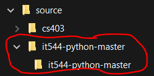
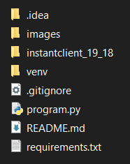
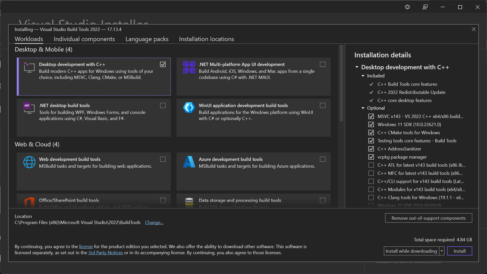

> If you're looking for documentation on **accessing Oracle or MongoDB from SQL Server**, see the Polybase documentation for [Oracle](../LINKED-ORACLE-POLYBASE.md) or the documentation for [MongoDB](../LINKED-MONGO-POLYBASE.md) in this repository.

> If you're looking for documentation on **setting up linked servers between two Microsoft SQL Servers**, see the [Linked Server documentation](../LINKED-SERVERS.md) in this repository.

# Accessing Oracle Database and Microsoft SQL Server from Python

This code will show you how you can access both Oracle Database and MS SQL from Python. It will demonstrate running a few queries as well as interacting with both databases simultaneously.

The basic version of the code in this repository works directly with the database servers and requires you to write queries, as you'll see in the code. An alternative option which is commonly used in modern programming environments is to use an object-relational mapper (ORM), which lets you represent the data tables as Python class instances (or whatever language you are working with). This is an advanced topic that we may explore later.

## Setting up the project

The main thing you need on your system is [Python](https://www.python.org/downloads/) (obviously!). Along with that, it's strongly recommended that you use an IDE such as PyCharm or VS Code to work with the code. 

The steps you will follow are as follows:

1. Make sure Python is set up on your system and the requirements for virtual environments are installed.
    - If you use Anaconda, you can [use it instead of `virtualenv`](#alternative-steps-for-anaconda-users). More information on this is included further on in the instructions.
2. [Download the code](#repository-download) and extract it to a folder on your machine.
3. [Download Oracle Instant Client](#oracle-instant-client) and put it in the project folder.
4. [Open the project](#open-the-project-in-your-editor) in PyCharm (or your editor of choice).
5. [Edit the configuration variables](#explaining-the-code) to match the address, port, username, password, and so on for your group's servers.
6. [Run the code](#running-the-code) to make sure the database connection is working!

Read on for details on these steps.

### Step 1 - Initial requirements setup

You also need to have `pip` installed, which is Python's built in package management toolset. On Windows, once you have Python installed, you should be able to run these commands at a command prompt to make sure `pip` is installed and updated to the latest version:

    python3 -m ensurepip
    python3 -m pip install -U pip

Finally, you need the `virtualenv` module, which lets you setup virtual environments. Alternatively, `anaconda` has a similar capability with the `conda` package manager. These instructions will use `virtualenv`, but if you're using `anaconda`, separate instructions are listed below.

To install `virtualenv`:

    python3 -m pip install virtualenv

All of the commands in this section are safe to run even if you already have the tools installed - the commands will simply ignore already-installed tools.

### Step 2 - Repository download

Download the repository by [**clicking this link**](https://github.com/fmillion-mnsu/it544-python/archive/refs/heads/master.zip).

The ZIP file contains one folder called `it544-python-master`. Extract this folder to somewhere on your system. When extracting, make sure you don't end up with a nested folder:

If you see this, copy the inner `it544-python-master` folder out of the nested folder.

### Step 3 - Oracle Instant Client

Since our servers are running Oracle 11g, you need to use **Oracle Instant Client** to connect to the servers. 

**Download Oracle Instant Client using these links:**

- [64-bit version for Windows](https://download.oracle.com/otn_software/nt/instantclient/1918000/instantclient-basiclite-windows.x64-19.18.0.0.0dbru.zip)
- [64-bit version for Apple Silicon Macs](https://download.oracle.com/otn_software/mac/instantclient/233023/instantclient-basic-macos.arm64-23.3.0.23.09-1.dmg)

Windows: Download the above link and open the ZIP file. You will see one folder named `instantclient_19_18` inside the ZIP file. **Extract this folder to the place where you extracted the source code.** Do not copy the files out of the folder - leave the folder intact!

If you have properly extracted the Oracle client, your `it544-python-master` folder should look similar to this (the `.idea` and `venv` folders is part of PyCharm and the virtual environment and you may not have it yet if you have not opened the project):

Mac: Run the DMG installer file. 

### Step 4 - Open the project in your editor

If you are using PyCharm, open the `it544-python-master` folder. (Note that depending on how you extracted the data, you may have a nested folder - e.g. `it544-python-master\it544-python-master`. You want to select the *inner* folder in this case.) If configured correctly PyCharm should offer to setup the environment for you. 

#### If PyCharm does not offer to setup the environment, or if you are using a different IDE

Open a **command prompt** and use the `cd` command to move to the path you extracted the files to.

Run the following command to create a virtual environment:

    python3 -m virtualenv venv

Now, run one of the following commands depending on your environment:

    * **Windows, normal command shell**: `venv\scripts\activate.bat`
    * **Windows, PowerShell**: `. .\venv\scripts\activate.ps1`
    * **Mac/Linux**: `source venv/bin/activate`

    > Windows users: You can determine if you are using PowerShell by looking at your prompt - if it starts with `PS`, you are on PowerShell. If not (e.g. it starts with `C:\Users\...`) then you are using the normal command shell.

You will know that the virtual environment activated successfully if you see that your prompt now begins with `(venv)`.

Finally, run this command to install the libraries into the virtual environment.

    pip install -r requirements.txt

> If you are on Windows and receive a compilation error, you may need to install the Visual Studio Build Tools. You can download the installer at [this link](https://aka.ms/vs/17/release/vs_BuildTools.exe)
>
> Once you run the installer, check the "C++" option as shown here. 
>
> 

### Alternative steps for Anaconda users

If you use Anaconda, you can setup a `conda` environment instead of using `virtualenv`. 

Open the **Anaconda Powershell Prompt** from your Start menu and `cd` to the directory you have extracted the code to. Then, run these commands to setup your environment (note: you can replace `it544` with whatever environment name you wish; just make sure to use the same name whenever referencing the environment.)

    conda create it544
    conda activate it544
    conda install pip
    pip install -r requirements.txt

From here on, you can open the code in PyCharm or whatever editor you are using. Note that in some cases PyCharm may fail to detect the Conda environment, so you may need to keep the Anaconda prompt window open to manually run your code (i.e. `python program.py`).

### Step 5- Explaining the code

The code is contained in `program.py`.

The first part of the code contains configuration values that **you must set prior to running the code.** If you don't set these values, the code won't run - that's on purpose!

After you have set up the variables, you should be able to run the code. The variables default to the SP database, but you can (and should) change them as required by your assignments and projects.

A few key points:

- For SQL Server, do not include the comma and port number in the `MSSQL_HOST` field. For example, if your server is `g1.campus-quest.com,21000`, then `MSSQL_HOST` should be simply `g1.campus-quest.com` and `MSSQL_PORT` should be `21000`.
- Leave the `ORACLE_SID` value as `xe` - no need to change it.
- To make sure the code works, leave the database as `SP`. The sample `select` queries reference the `SP` database.

You can see that it is quite straightforward to execute a `SELECT` query and iterate over the results. You can provide *any* `SELECT` query and iterate over it this way.

One more thing - make sure you read and comment out the line that raises a `SystemError`. This is to make sure you're paying attention!! :-D

### Note about SQL Injection

When you are forming SQL queries, make sure to be mindful of SQL injection attacks - these are extremely easy to allow if you are simply concatenating strings together to form SQL statements. Something like `"SELECT * FROM myTable WHERE id = " + id` can prove *catastrophic* - the user could simply make `id` equal to a string such as `0; DROP TABLE myTable; --`. The resulting query would look like this: `SELECT * FROM myTable WHERE id = 0; DROP TABLE myTable;`!! 

To avoid SQL injection vulnerabilities, the easiest way is to use *parameterized* queries. You do this by replacing parts of the query that you expect to receive input from some other source (such as a user, a file, etc.) with an identifier in the query string - such as `%s`, `?` or `:` depending on the DBMS. For SQL Server, you can use `%s`, and for Oracle you can use `:` followed by an identifier.

> **Example safe query in Oracle:**
>
>     cursor.execute("select * from myTable where id = :id",(0,))
>
> **Example safe query in SQL Server:**
>
>     cursor.execute("select * from myTable where id = %s",(0,))

### Step 6 - Running the code!

Once you've configured the settings, you should be able to run the code. If you are successful, you will see the output of two `SELECT` queries - one run against Oracle, and the other against SQL Server!

If you have configured everything successfully, you should see output like this:

## For More Information

- [Developing Python Applications for Oracle Database](https://www.oracle.com/database/technologies/appdev/python/quickstartpythononprem.html) at Oracle.
- The [Python oracledb](https://python-oracledb.readthedocs.io/en/latest/index.html) documentation.
- The [Python pymssql](http://www.pymssql.org/en/stable/index.html) documentation.

